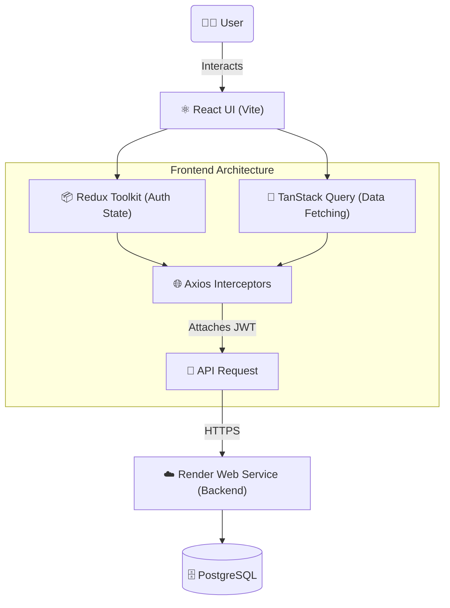

# WaziApp Frontend

This is the React (Vite) frontend for WaziApp, a multi-tenant project management SaaS. 
It communicates with the Node.js backend using Axios and manages state using Redux Toolkit and TanStack Query.

## System Architecture



## Features
- **Apple-Inspired Design:** Clean, minimalist light theme with glassmorphism overlays.
- **Authentication:** JWT-based login with persistent state.
- **Role-Based Access Control:** UI elements (like "Create Project" or "Delete Project") conditionally render based on backend permissions.
- **Optimistic UI:** Instant updates via TanStack Query mutations.

## Getting Started

1. Clone the repository and install dependencies:
   ```bash
   npm install
   ```

2. Configure environment variables in a `.env.local` file:
   ```env
   VITE_API_URL="http://localhost:5000/api"
   ```

3. Run the development server:
   ```bash
   npm run dev
   ```

## Production Deployment
The application is configured to deploy directly to Vercel.
- **Framework Preset**: Vite
- **Build Command**: `npm run build`
- **Output Directory**: `dist`
- Environment variables required: `VITE_API_URL` (pointing to the live backend URL)
